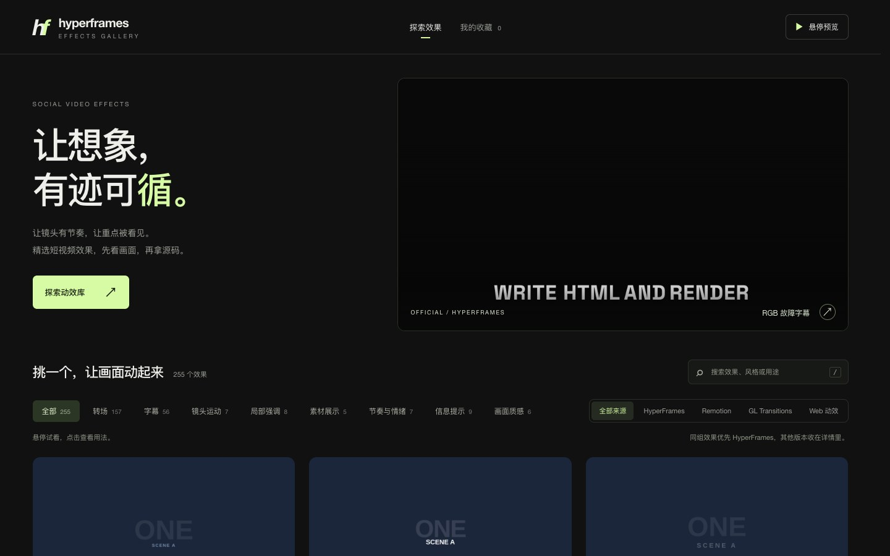
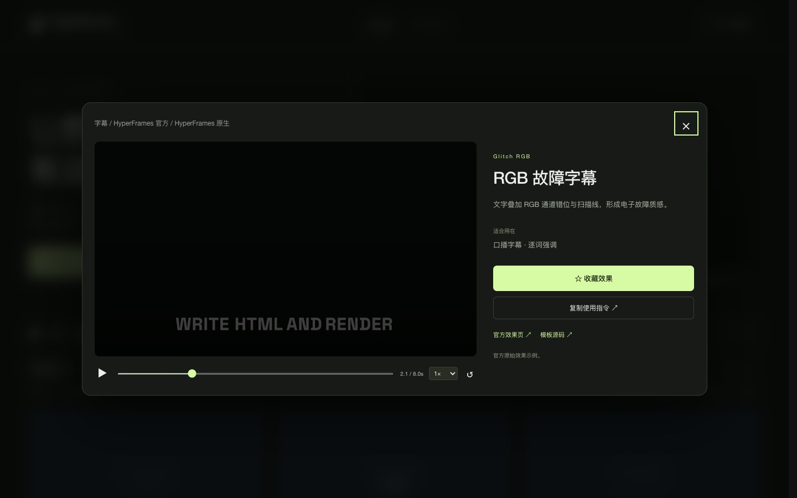
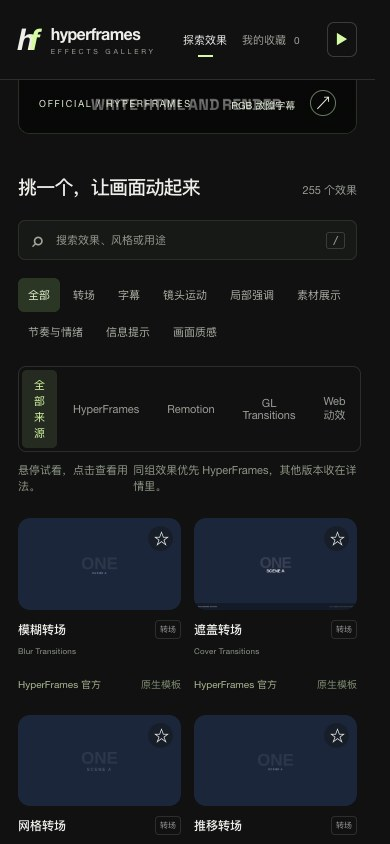

<p align="right">
  <a href="./README.zh-CN.md"></a>
</p>

# HyperFrames Effects & Captions Gallery

[](https://77654321.xyz/#library)


An interactive, source-traceable gallery of **HyperFrames effects, video transitions, animated captions, camera motion, WebGL shaders, and social-video UI effects**. Preview the real motion first, then open the pinned source or copy an integration brief.

**[Explore the live gallery →](https://77654321.xyz/#library)**



## What this project is

HyperFrames Effects Gallery is a visual index for people building short-form video with AI coding agents or HTML-based video pipelines. It brings official HyperFrames blocks and relevant community effects into one searchable interface without pretending every source uses the same runtime.

- Official HyperFrames entries link to the catalog and pinned registry source.
- Remotion, GLSL, and Web entries retain their original framework and integration status.
- Duplicate visual behaviors are grouped, with the HyperFrames version shown first when available.
- Every card uses a real author preview or a preview rendered from the pinned source.

## Catalog at a glance

| Category | Effects |
| --- | ---: |
| Transitions | 157 |
| Animated captions | 56 |
| Camera motion | 7 |
| Emphasis and callouts | 8 |
| Asset presentation | 5 |
| Rhythm and mood | 7 |
| Information cues | 9 |
| Texture and finish | 6 |
| **Total** | **255** |

The catalog currently contains **74 official HyperFrames entries** and **181 community entries**, representing **266 pinned source versions** after visual deduplication.

## Integration status

| Label | Meaning |
| --- | --- |
| **HyperFrames native** | An official registry block or component with its install/source path preserved. |
| **Remotion** | A React/Remotion component or family that needs a Remotion host or a deliberate HyperFrames port. |
| **GL Transition** | A GLSL transition that needs textures, progress, aspect-ratio parameters, and a WebGL timeline host. |
| **Web effect** | A browser/SVG/CSS component that needs its animation clock connected to the video timeline. |

A preview means the effect was verified visually. It does **not** mean every community effect can be installed with `npx hyperframes add`.

## Gallery features

- Eight practical short-video categories and five source filters
- Search by effect name, style, use case, or upstream author
- Poster-first loading with one active video preview at a time
- Hover preview on desktop and click-to-preview details
- Playback progress, speed control, replay, and local favorites
- Pinned source links, license notes, caveats, and copyable AI briefs
- HyperFrames-first deduplication with alternative versions preserved

<table>
  <tr>
    <td width="70%"></td>
    <td width="30%"></td>
  </tr>
</table>

## Run locally

```bash
git clone https://github.com/genoooool/hyperframes-effects-gallery.git
cd hyperframes-effects-gallery
python3 scripts/serve.py
```

Open `http://127.0.0.1:4173`. The included server supports MP4 byte ranges so seeking and preview start offsets work correctly.

The gallery UI only reads [`data/gallery-effects.json`](data/gallery-effects.json). Preview videos and posters are stored under `assets/` so browsing does not execute third-party template code.

## Rebuild and verify

The repository keeps the pinned upstream files, rendered previews, collection scripts, and deduplication rules used to publish the catalog. The main entry points are:

```bash
python3 scripts/publish_gallery.py
python3 scripts/test_dedup.py
```

Rendering additional Remotion or WebGL previews requires Node.js, FFmpeg, Chrome, and the locked dependencies in `tools/community-render/`. See the [collection and rendering notes](docs/COLLECTION_PIPELINE.zh-CN.md) and [source audit](docs/ai/SOURCE_AUDIT.md).

## AI and crawler access

- [`/llms.txt`](https://77654321.xyz/llms.txt) provides a compact, machine-readable project summary and canonical links.
- [`data/gallery-effects.json`](https://77654321.xyz/data/gallery-effects.json) is the structured catalog used by the live gallery.
- Every effect records its category, source family, integration status, preview provenance, and source URL.

## Frequently asked questions

### Is this an official HyperFrames project?

No. This is an independent community gallery. Official entries link back to the [HyperFrames catalog](https://hyperframes.heygen.com/catalog) and pinned source.

### Can Remotion or GLSL effects be used in HyperFrames?

Yes, after adaptation. Remotion components need their React animation mapped to a HyperFrames composition. GLSL transitions need a WebGL host and a frame-addressable progress value. The copied brief states the actual integration path for each source.

### Are the previews videos or live effects?

The gallery serves lightweight local MP4 previews for reliable browsing. Those previews come from author media or deterministic rendering of the pinned source; the detail panel explains which method was used.

## Credits and licenses

This repository is not affiliated with HeyGen, HyperFrames, Remotion, or the indexed authors. Upstream source and media remain under their original licenses or authors' terms. See [`THIRD_PARTY_NOTICES.md`](THIRD_PARTY_NOTICES.md) before reusing an effect.
